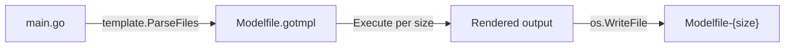

# Design Document — modelfile-generator

## Overview

A single-file Go program (`ollama/main.go`) that reads `Modelfile.gotmpl`, executes it once per model size, and writes the rendered output to `Modelfile-{size}` files. The template uses standard Go `text/template` delimiters. Ollama's own `{{`/`}}` syntax is escaped inside the template using `{{ "{{" }}` / `{{ "}}" }}`, so Go's template engine emits literal braces in the output.

The program is intentionally minimal — no flags, no external dependencies, no concurrency. It reads one file, loops over a slice, writes files, and exits.

## Architecture



The entire program lives in `main()` inside `ollama/main.go`. There are no packages, interfaces, or services to wire together.

### Flow

1. `template.ParseFiles("Modelfile.gotmpl")` — parse the template once.
2. `for _, size := range modelSizes` — iterate over the predefined slice.
3. `tmpl.Execute(buf, data)` — render the template with the current size into a buffer.
4. `os.WriteFile(filename, buf.Bytes(), 0644)` — write the buffer to disk.
5. On any error: print to stderr, exit with code 1.

## Components and Interfaces

This is a single `main` package with no exported API. The key moving parts are:

| Component                               | Role                                                                            |
|-----------------------------------------|---------------------------------------------------------------------------------|
| `modelSizes` (package-level `[]string`) | Defines the set of sizes to generate: `"0.8b"`, `"2b"`, `"4b"`, `"9b"`, `"35b"` |
| `main()`                                | Orchestrates parse → loop → render → write                                      |
| `text/template` (stdlib)                | Parses and executes the `.gotmpl` file                                          |
| `os.WriteFile` (stdlib)                 | Writes each rendered file to disk                                               |
| `bytes.Buffer`                          | Captures template output before writing                                         |

### Template Data Context

The template references `{{ variable }}`, which in Go's `text/template` means it looks up a key or field named `variable` in the data passed to `Execute`. The simplest approach is a `map[string]string`:

```go
data := map[string]string{"variable": size}
tmpl.Execute(&buf, data)
```

This keeps the template unchanged and avoids needing a struct with an exported field.

## Data Models

There are no persistent data models. The runtime data is:

| Name            | Type                | Description                                               |
|-----------------|---------------------|-----------------------------------------------------------|
| `modelSizes`    | `[]string`          | Hardcoded slice of model size strings                     |
| Template data   | `map[string]string` | Single key `"variable"` mapped to the current size string |
| Output filename | `string`            | Formatted as `"Modelfile-" + size`                        |

### Template Escaping

The template `Modelfile.gotmpl` contains two kinds of `{{ }}` usage:

1. **Go template actions** — e.g. `{{ variable }}` — these are evaluated by `text/template` and replaced with the value from the data map.
2. **Escaped Ollama braces** — e.g. `{{ "{{" }}` — these are Go template string literals that emit literal `{{` in the output, preserving Ollama's template syntax.

No special configuration is needed; standard `text/template` handles both correctly.

## Error Handling

All errors are fatal. The program uses a simple pattern:

1. **Template parse failure** (file missing, syntax error): print error to stderr via `fmt.Fprintf(os.Stderr, ...)`, call `os.Exit(1)`.
2. **Template execution failure** (unexpected data issue): same — stderr + exit 1.
3. **File write failure** (permissions, disk full): same — stderr + exit 1.

There is no retry logic, no partial output cleanup, and no graceful degradation. If any size fails, the program stops immediately. This is appropriate for a developer tool run manually.
